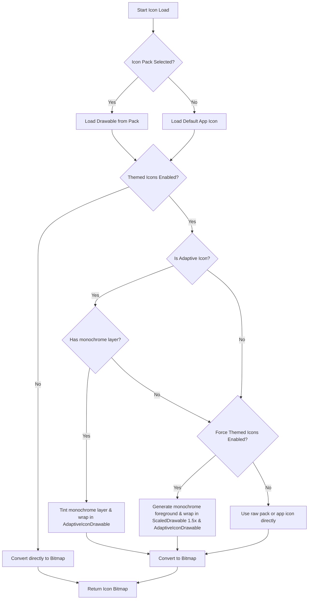

# App Icon Customization & Theming Implementation

This document details the design decisions and implementation details for the custom icon packs and themed icon features added to the Applications Provider.

## 1. Feature Overview
- **Custom Icon Pack Support**: Allows users to load and display app icons from any ADW, Nova, Go, or Solo-compatible icon pack (like [Lawnicons](https://github.com/LawnchairLauncher/lawnicons)).
- **Dynamic Theming / Material You**: Applies dynamic color matching to standard system adaptive icons, system-supported themed icons, and third-party icon packs.
- **Forced Theming**: Generates clean monochrome icons for apps that do not natively support Material You themed icons.

## 2. Technical Architecture & Flow

The main entry point for loading app icons is the `loadAppIconBitmap` function in `AppIconLoader.kt`. The process is as follows:



## 3. Sizing Correction & Double-Scaling Prevention

### The Sizing Discrepancy
- Legacy (non-adaptive) vectors or bitmapped icons loaded from custom icon packs are wrapped in `AdaptiveIconDrawable` to support background masking.
- However, the system's `AdaptiveIconDrawable` scales its foreground down to fit the centered **72dp safe zone** of a **108dp canvas** (a scale-down factor of `72/108 = ~0.66`).
- When we extract the foreground of an adaptive icon, rasterize it, and wrap it inside a new `AdaptiveIconDrawable`, it gets scaled down **twice**, resulting in a tiny icon (~44% of the correct size).

### The Solution: `ScaledDrawable`
We implemented a custom [ScaledDrawable](file:///Volumes/realme/Dev/Search/app/src/main/java/com/mrndstvndv/search/util/AppIconLoader.kt#L18) class that scales the canvas by `1.5f` (the inverse of `72/108`) around its center during drawing:
```kotlin
class ScaledDrawable(private val drawable: Drawable, private val scale: Float) : Drawable() {
    override fun draw(canvas: Canvas) {
        val bounds = bounds
        canvas.save()
        canvas.scale(scale, scale, bounds.exactCenterX(), bounds.exactCenterY())
        drawable.draw(canvas)
        canvas.restore()
    }
    // ... forwards bounds changes and state methods
}
```
This is wrapped around any rasterized/forced-themed foregrounds inside `loadAppIconBitmap`, perfectly counteracting the system scale-down.

## 4. Material You Color Resolution
To ensure themed icons match the home screen theme uniformly, we dynamically resolve the background and foreground colors:
- **Foreground Tint**: Matches the primary system accent color (`system_accent1_600` in light theme / `system_accent1_200` in dark theme).
- **Background Shape Color**:
  - In **Light Theme**, we use `system_accent1_100` (dynamic light pink accent), which matches standard system themed icons and natively-resolved Lawnicons backgrounds.
  - In **Dark Theme**, we use `system_neutral1_900` (dynamic dark grey surface), creating a sleek dark appearance.

## 5. UI Integration
Settings are separated into a clean, unified **App Icons** section within [AppSearchSettingsScreen.kt](file:///Volumes/realme/Dev/Search/app/src/main/java/com/mrndstvndv/search/ui/settings/AppSearchSettingsScreen.kt#L121) using standard settings group components:
1. **Themed icons**: Switch to enable/disable system and pack-level monochrome coloring.
2. **Force themed icons**: Switch to forcefully convert colorful non-adaptive icons into dynamic themed icons (disabled when themed icons are turned off).
3. **Icon pack**: Launches a package dialog listing all installed launcher icon packs.
